# Preschool Learning App
Preschool education management app empowering administrators to manage schedules, teachers to monitor attendance, students to sign up for classes and manage their information.
### Login page
There are 3 roles for logging in: administrator, teacher and student. You can also highlight the guest role, which is owned by each user who has not logged in to the system and who only has access to the "About School" and "Home" pages. To log in, you should click the "Login" button and you will be given the opportunity to log in.
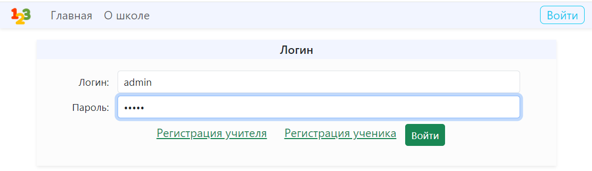
### Page for working with subjects
Logging in as an admin allows you to manipulate items: add, edit, delete and view the list of items.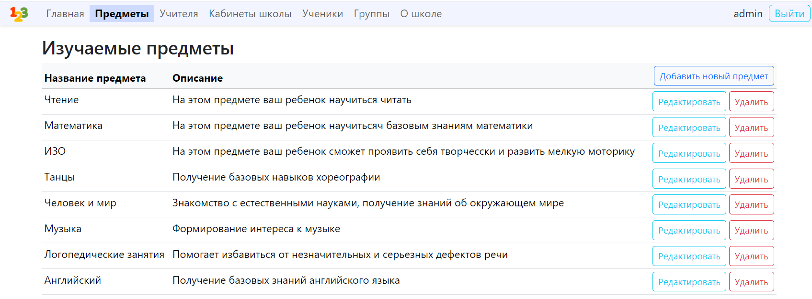
### Subject editing page
The page for editing items is also provided for adding, you can change the name and description. With the "Apply" button we save the records to the database and remain on the page, with the "Save" button we save the records to the database and return to the list of items, with the "Close" button we simply close without saving the changes.
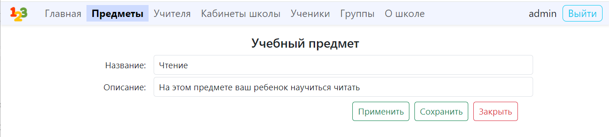
### Page for working with teachers
A page with a list of teachers, and since adding and editing occurs on behalf of the teachers themselves, the administrator can only delete them.
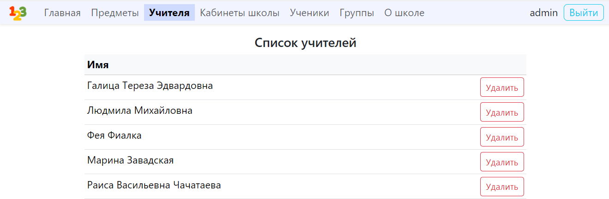
### Page for working with classrooms
On the page with the list of audiences, with the building address, floor and the number of the office itself. Where you can add, edit and delete audiences from the list of audiences.
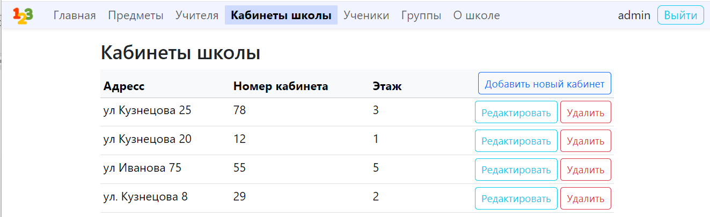
### Classroom editing page
On the page for editing and adding classrooms, where you can also change the address, number and floor.
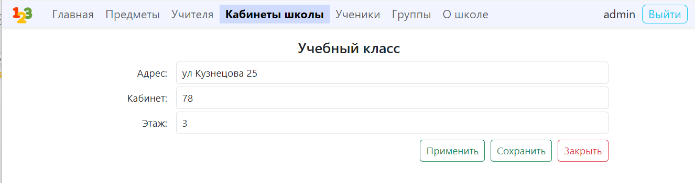
### Student list page
On the page where you can access the list of students, and where adding and editing takes place, the students themselves are protected, so the administrator can only delete them.
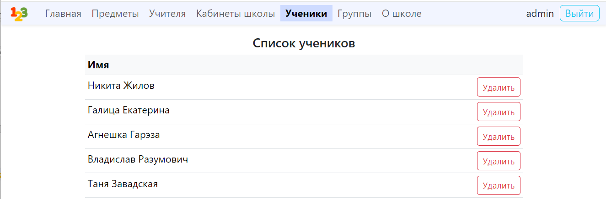
### Study groups page
On the page with the list of groups that you can work with by adding, deleting, editing.
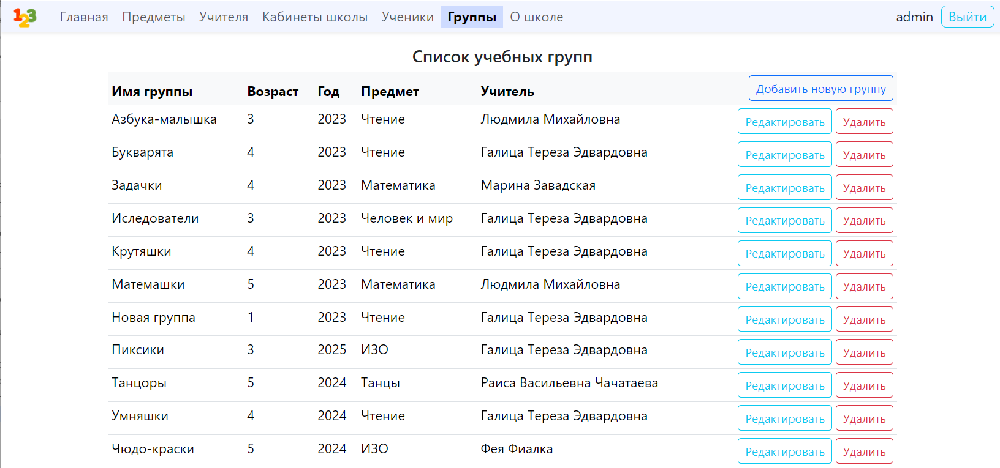
### Group editing page
On the group editing page, in addition to the characteristics directly related to this object, you can also set a schedule.
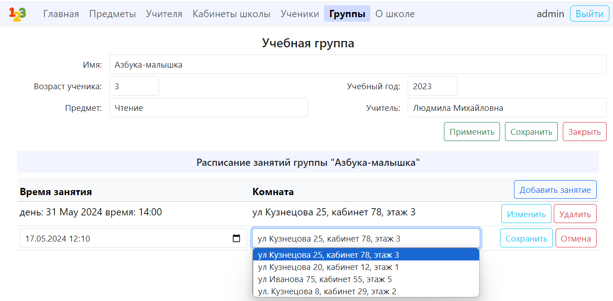
### Teacher's personal account
If the user logs in as a teacher, then a teacher's office will be provided, where you can edit personal information and account information, add what subjects the teacher is able to teach, and also have access to the group schedule.
#### Page in the teacher's office with personal information
If the user logs in as a teacher, then a teacher's office will be provided, where you can edit personal information and account information, add what subjects the teacher is able to teach, and also have access to the group schedule.
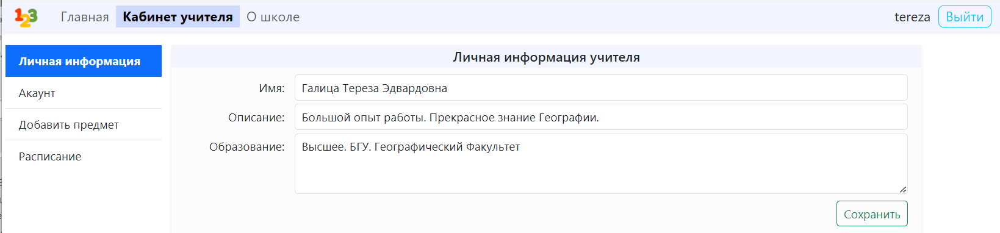
#### Page in the teacher's office with information about the account
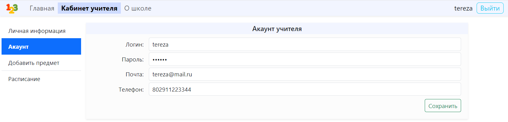
#### Page in the teacher's office with added subjects
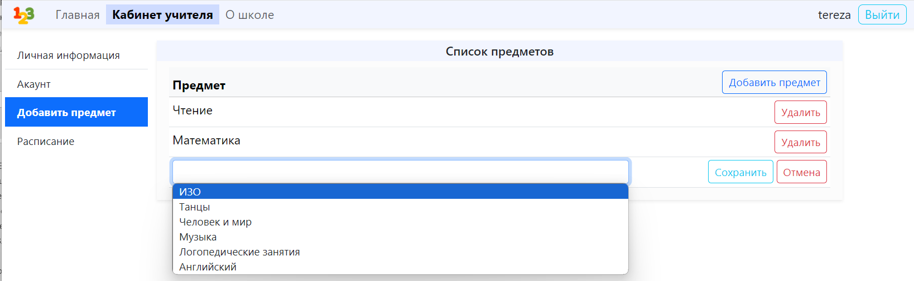
#### Page in the teacher's office with the group schedule
In the group schedule, in addition to information about the groups, you can see the presence of students who attended the lesson.
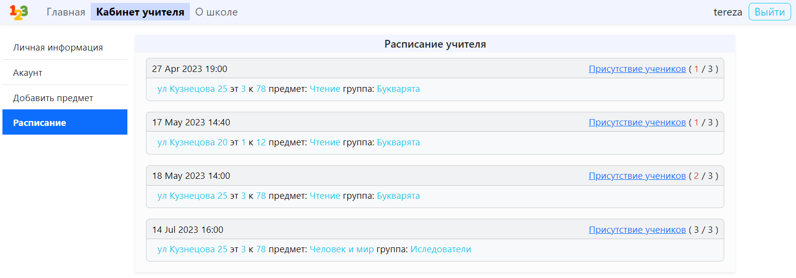
#### Page with attendance by group schedule
By clicking on the “Student Presence” inscription, you can go to a page where you can mark the presence of students in the group according to the schedule.
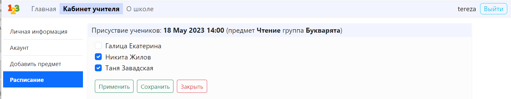
### Student's personal account
If the user logs in as a student, they will be provided with a student account where they can edit their personal information and account details, add groups they can enroll in, and access the schedule of student groups.
#### Page in the student's office with personal information
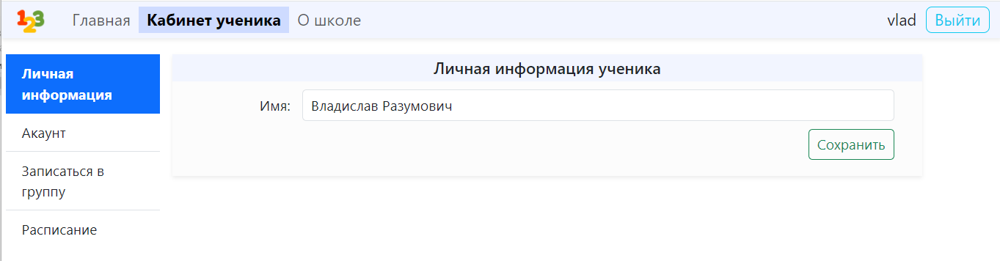
#### Page in the student's office with account information
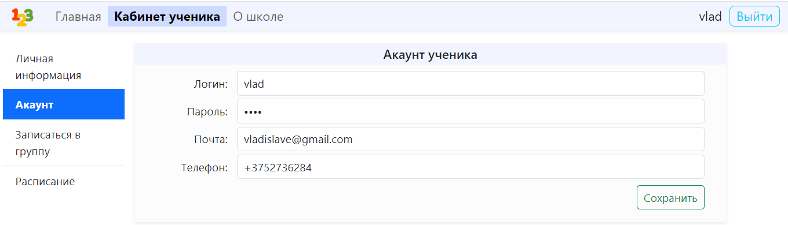
#### Page in the student's office with the addition of groups
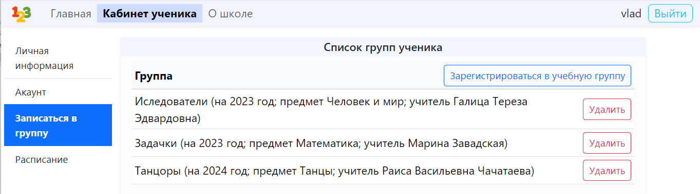
#### Page in the student's office with the group schedule
In the group schedule, in addition to information about the groups, you can see the student's attendance. A group on the schedule marked with a light green marker with a check mark indicates that the student was present at the lesson, a red one with a minus means that he was absent, and if there is no mark, the lesson has not yet been held.
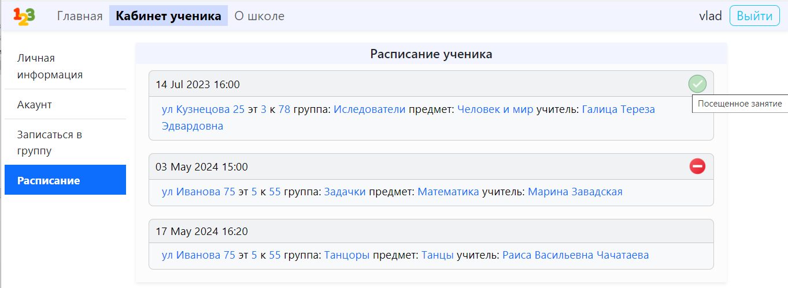
